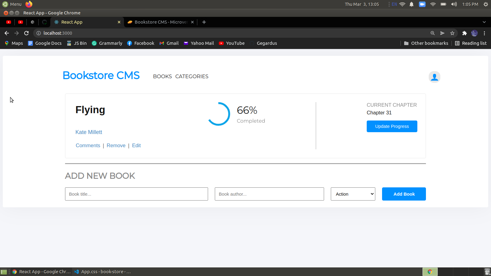

# Bookstore

> "Bookstore" project lays the foundations for the Bookstore website. It is created as a React and Redux app and structured as a ducks pattern. This part of the project is also set with routing using React Router.

## Built With

- React and Redux

## Live Demo

[Not available yet]()

## Getting Started

To get a local copy up and running follow these simple example steps:

### Prerequisites

- clone repo: `git@github.com:Gegardus/book-store.git`

- then `cd book-store`

### Install

- run `npm install` to install dependencies

- run `npm start` to enable webpack live server

## Contribute

Contributions, issues, and feature requests are welcome!

Feel free to check the [issues page](https://github.com/Gegardus/book-store/issues)

## Author

👤 **Vahan Khachvankian**

- GitHub: [@githubhandle](https://github.com/Gegardus)
- Twitter: [@twitterhandle](https://twitter.com/Gegardus)

## Acknowledgements

The authors highly appreciate the help in the project from all the participants of this week's program for the timely response to all questions.

## 📝 License

This project is [MIT](./MIT.md) licensed.
